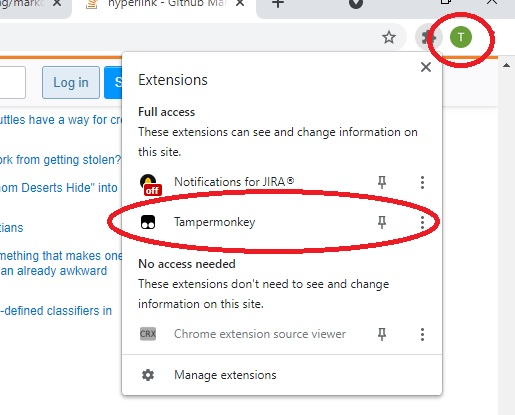
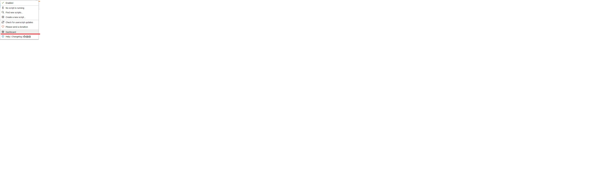
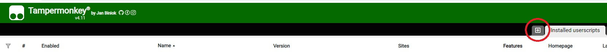
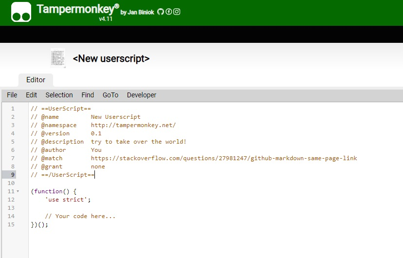
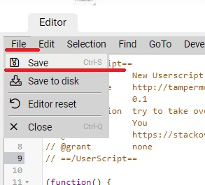

# Відновлення можливості одночасної роботи з Державним реєстром актів цивільного стану громадян та АРКАН (можливо й інші, невідомо)

## Передісторія
**05.04.2021** міністр Міністерства Юстиції Денис Малюська [заявив](https://sud.ua/ru/news/ukraine/197994-maye-litati-onovili-platformu-na-yakiy-pratsyuyut-reyestri-minyustu) про оновлення програмного забезпечення ряду реєстрів:
* ДРРП (держреєстр речових прав на нерухоме майно)
* ДРАЦС (акти цівільного стану)
* АСВП (автоматизована система виконавчого провадження)

>За інші реєстри невідомо, але в реєстрі ДРАЦС додатково додано перевірку криптографічної бібліотеки
*"Користувач центру сертифікації ключів. Web-бібліотеки підпису"* (EUSignWebInstall.exe), чи здіснювалась ця перевірка до оновлення мені невідомо, але якщо оновити EUSignWebInstall.exe до версії 1.3.1.58, то вона пройде перевірку на сайті ДРАЦС, але після цього неможливо увійти до АРКАну.

**Версії EUSignWebInstall.exe, що пропонуються для завантаження (про які мені відомо):**
* Зі сторінки входу до АРКАНу: 1.3.1.45 *(посилання відсутнє, завантаження здійснюється зі сторінки самого сервісу у разі відсутності у користувача встановленної або запущенної версії)*
* На сайті АЦСК МВС: 1.3.1.46  [посилання](https://ca.mvs.gov.ua/download/install/EUSignWebInstall.exe)
* ДРАЦС (оновлення або завантаження): 1.3.1.58 [посилання](https://iit.com.ua/download/productfiles/EUSignWebInstall.exe)

## Шляхи вирішення
* Мін‘юст (ДП «Національні інформаційні системи») вимкне перевірку версії бібліотеки EUSignWebInstall.exe при вході. Перевірено, що з реєстром можливо працювати і на версії 1.3.1.46, і 1.3.1.45
* Інші реєстри, що використовують EUSignWebInstall.exe оновлять версію бібліотеки (це потребує оновлення коду роботи з нею). Вважаю малоймовірним

## Моє рішення (сподіваюсь тимчасове)
Використовуючи плагін для браузера, що дозволяє виконувати так званні "UserScript" (користувацьки скрипти) замінити функцію, що здійснює перевірку встановленої версії EUSignWebInstall.
Рішення не стабільне та може викликати несподівані помилки при вході на сайт https://regdracs.minjust.gov.ua/, але працює.

## Як встановити та налаштувати
>При написані використовувався плагін "Tampermonkey", браузер **Google Chrome версії 89.0.4389.114 (64-bit).**
Як буде працювати на інших браузерах чи іншій версії невідомо, тестування не проводив.

РОЗГОРНУТИ ТЕКСТ

**Завантажити плагін "Tampermonkey":**
* Google Chrome [(відкрити сторінку завантаження плагіну)](https://chrome.google.com/webstore/detail/tampermonkey/dhdgffkkebhmkfjojejmpbldmpobfkfo)
* Firefox [(відкрити сторінку завантаження плагіну)](https://addons.mozilla.org/ru/firefox/addon/tampermonkey/)
* Opera [(відкрити сторінку завантаження плагіну)](https://addons.opera.com/ru/extensions/details/tampermonkey-beta/)

**Встановити розширення**

**Завантажити скрипт**

**Додати скрипт до роширення Tempermonkey:**

> Процес додавання скрипта зробив на прикладі браузера Google Chrome версії 89:

1. **Відкрити емблему плагінів та натиснути на іконку плагіну Tempermonkey**
   

1. **З випадаючого меню обрати "Dashboard"**

   

1. **У правій частині натиснути на плюс (+)**

   

1. **Повністю замінити текст скрипту на скопійований за** [**посиланням**](https://raw.githubusercontent.com/kpycnuk/regdracs/main/regdracs_TM.js) *(для відкриття у новій вкладці зажміть Ctrl+клік мишкою)*

   

1. **В меню натиснути на "File" та з випадаючого меню обрати "Save"**

   

1. **Закрити сторінку та спробувати перейти на сайт ДРАЦС**

#### У разі виникнення зауважень або пропозицій, відкритий до спілкування. :smirk:
Писати на електрону пошту kpycnuk@gmail.com
